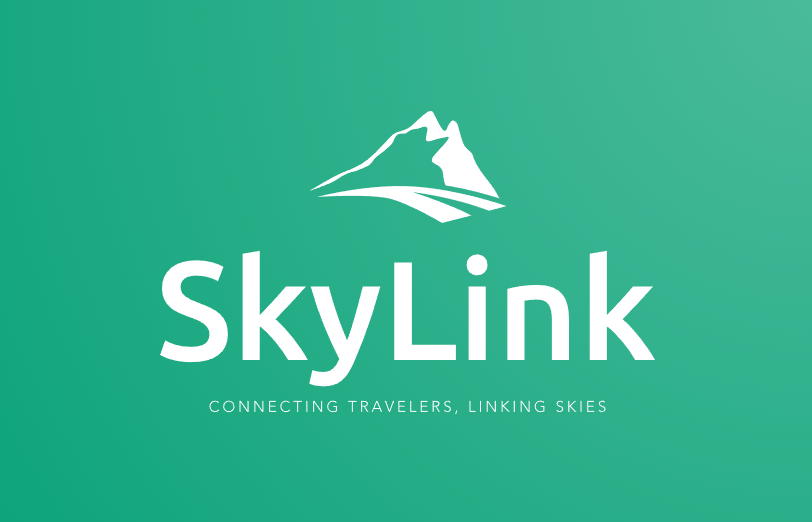

# SkyLink: Connecting Travelers, Linking Skies

🌍 Welcome aboard SkyLink – your passport to a world of seamless exploration and flight reservations. Our mission is to dissolve the distance between dreams and reality by crafting an extraordinary flight booking experience that transcends expectations.

## Embark on a Journey Beyond Booking

🚀 SkyLink goes beyond traditional flight booking platforms. We're your travel companion, your compass to new horizons, and your co-pilot on the path of adventure. Here's what sets us apart:

### 🌐 Global Connection, Effortless Selection

Discover flights that align with your wanderlust. With SkyLink, effortlessly explore and select from a tapestry of flight options that spread across the globe.

### 🌈 Dreams Take Flight, Details Take Center Stage

Every flight tells a story. SkyLink crafts these stories with intricate details – from departure times to layovers, your journey is painted with vivid strokes of information.

### 🎩 Passenger Profiling, Magic of Personalization

We believe travel should be personal. SkyLink tailors your experience through detailed passenger profiling, ensuring every journey is uniquely yours.

### 🎟️ Automated Enchantment, Tickets Enriched

The magic of travel starts with a ticket. SkyLink casts its spell by automatically conjuring enriched tickets that capture the essence of your journey.

### 🔐 Secure Skies, OTP Guarded

Safety is paramount in the skies and online. SkyLink ensures your transactions take off safely with the guardian of online skies – OTP verification.

### ✈️ Flight Transformation, Database Wizardry

Change is constant, even in the skies. With SkyLink's database wizardry, flight transformations are executed seamlessly, ensuring your journey aligns with your vision.

## Boarding Pass to Contribution

Join the league of innovators! Here's how you can contribute to SkyLink's journey:

1. 🛠️ Clone this repository: `git clone https://github.com/apo-orvv/skylink.git`
2. 🌆 Create your development playground and set up dependencies.
3. 🚀 Launch the application locally or take it to the cloud.
4. 🌟 Share your explorations, enhancements, and magic with the community.

## Signals for Contact

Have celestial questions or suggestions? Connect with us via our [Inbox](mailto:apoorvdsp@gmail.com) or dispatch a signal in our repository's issue galaxy.

## Creative Commons Constellation

SkyLink is a constellation in the Creative Commons galaxy. This voyage is guided by the principles of the [CC BY-NC-SA 4.0 License](LICENSE).

---

Embark on a journey where imagination meets the skies, where connections are forged and horizons are limitless – SkyLink: Connecting Travelers, Linking Skies. 🌌
